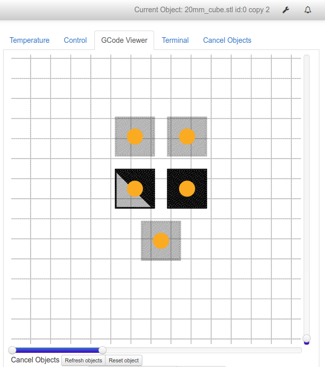
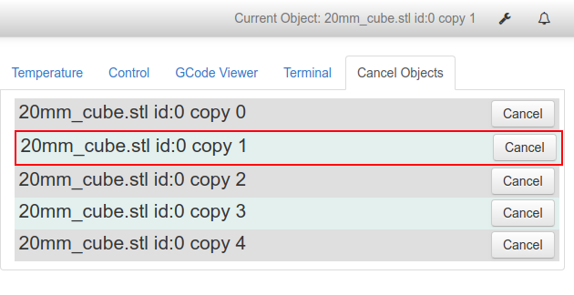

Want to support this work? Buy Me a Coffee. https://www.buymeacoffee.com/ppaukstelis
# OctoPrint-Cancelobject

This plugin allows the user to interactively cancel objects in gcode based on comment tags added by the slicer.
See below for instructions for specific slicers.
### New version 0.4.2, 07/2020
* Remove case sensitivity for `@Object` tags.
* Improvements to absolute extrusion tracking.
* Read object information from SuperSlicer object comments to create `@Objectinfo` tags. This includes object centers so these no longer have to be calculated from extrusion moves. Special note: as of this moment cloned objects will not give unique positions. 
* `; stop printing object` comments now generate `@Objectstop` tags which should improve compatibility with extruder wipes in PrusaSlicer/SuperSlicer

### New version 0.3.0, 02/26/2019
* Gcodeviewer integration. Objects are tagged wtih an orange dot in the Gcodeviewer and can be cancelled directly.
* Improved tracking of absolute extrusion distances. It is still recommended to use relative extrusion distances in your slicer.
* See below for tips and notes for using with various slicers.

## Configuration
### Settings
* By default, active object (current object being queued) is displayed in the NavBar.
* Gcode (comma delimited) can be injected before or after the server reaches a cancelled object.
  This may be need for retractions or resetting extrusion distance in some cases.
* Gcode blocks that contain just functional information, like beginning or ending scripts, can be prevented from appearing in the tab by including them in a comma delimited list in the Ignored Object section. Defaults to `STARTGCODE,ENDGCODE`
* If there are Gcode commands in a cancelled object that should not be skipped, these can be included as a comma delimited list.
* For all slicers, it is recommended to enable relative extrusion in printer settings.

### Cura (3.6.0 or greater)
* Turn combing off! As of right now, Cura writes additional moves after ;MESH tags as part of combing that cause issues.
* Objects are automatically tagged with the `;MESH:<stl file name>` tag.
* Please note that the way that Cura does supports means that ALL supports are placed into an object called `NONMESH`. Cancelling an object will not cancel its supports.
* Do not use stl files that have non-ASCII characters. This will confuse all current versions of Marlin.
* Is is a good idea to add `;MESH:ENDGCODE` at the start of your ending gcode script.
### PrusaSlicer/SuperSlicer
* Enable `Label objects` in the Output section
* Object names can be modified in the object list in the right panel. Note, this only works for objects that are imported independently, not on copies/clones of objects.
* For the end custom GCODE, include at the start: `; printing object ENDGCODE`
### Slic3r
* Use the current development build snapshot: https://dl.slic3r.org/dev/
* Enable `Label prints with object ID` in the Output section
* Add `; printing object ENDGCODE` to the start of the end gcode in the Custom Gcode section (no spaces after `ENDGCODE`!)
### Simplify3D
* Create one process for each object or group of models you want to be able to cancel. Assign models to processes.
* Enable 'Allow zeroing of extrusion distance' setting in Gcode Tab.
* It is highly recommended to add `; process ENDGCODE` at the start of your Ending Script in S3D. Otherwise, if the last object that would be printed has been cancelled this will result in the rest of the ending script being ignored.
* If you are not using `Raise Z on retraction` setting you will likely want to include `G1 Z.*` in the Allowed G-code section of the settings.

## Other notes
* If you upload files directly to your octoprint instance, direct them to the `watched` directory and not the `upload` directory. This will make sure that the plugin processes your gocde and substitutes the `@Object` tag it uses to identify
* This plugin can only be used when streaming files via USB (no SD card support). If you are looking for SD card support, look into Marlin or RepRap firmware M486 commands.
* It is designed for use with Marlin and Marlin-flavored firmwares. The behaviour with other firmwares is unknown.
* Gcodeviewer integration requires that the object has to have had some printing moves before its coordinates are known. Use the `Refresh Objects` button to update. The exception to this is SuperSlicer which includes object information comments in the gcode that include object centers.
* Some slicers will place first layer extras (brim, raft, etc.) as part of an object. If this throws off the position of the objects in the gcodeviewer you can use the `Reset Objects` button.
## Setup

Install via the bundled [Plugin Manager](https://github.com/foosel/OctoPrint/wiki/Plugin:-Plugin-Manager)
or manually using this URL:

    https://github.com/paukstelis/OctoPrint-Cancelobject/archive/master.zip

